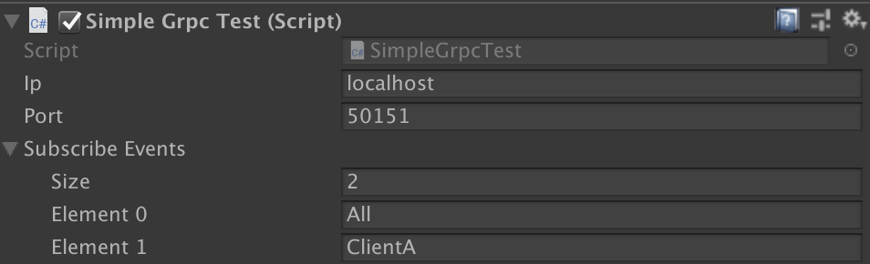

# Simple grpc unity client

## Description

## Install
.unitypackage

## Usage
- open "simplegrpc scene"

- client settings
  
Ip: server ip  
Port: server port  
SubscribeEvents: subscribe event name that request to server  

- publish events
click scene button ("All" or "ClientA")

